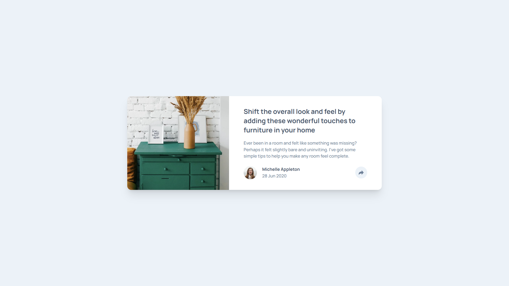

# Frontend Mentor - Article Preview Component Solution

This is a solution to the [Article Preview Component Challenge on Frontend Mentor](https://www.frontendmentor.io/challenges/article-preview-component-dYBN_pYFT).

## Table of Contents

- [Overview](#overview)
  - [The challenge](#the-challenge)
  - [Screenshot](#screenshot)
  - [Links](#links)
- [My process](#my-process)
  - [Built with](#built-with)
  - [What I learned](#what-i-learned)
  - [Continued development](#continued-development)
  - [Useful resources](#useful-resources)
- [Author](#author)
- [Acknowledgments](#acknowledgments)

## Overview

### The Challenge:

Users should be able to:

- View the optimal layout for the component depending on their device's screen size
- See the social media share links when they click the share icon

### Screenshot:

[](https://fm-article-preview-component.vercel.app)

### Links:

- Solution URL: [Article Preview Component Codebase](https://github.com/njorogejeff/fm-stats-preview-card-component)
- Live Site URL: [Article Preview Component Live Site](https://fm-article-preview-component.vercel.app)

## My Process

### Built With:

- Semantic HTML5 markup
- [Tailwind CSS](https://tailwindcss.com/) - CSS Framework - For styles
- [Vite](https://vite.dev/) - Frontend Build Tool
- CSS custom properties
- Flexbox
- CSS Grid
- Mobile-first workflow

### What I Learned:

I learned how to handle different component states across viewports using a mix of JavaScript and CSS utility classes.

**Share Functionality (Mobile vs Desktop)**

The share component behaves differently depending on the screen size:

- **Mobile:** The share options overlay the author information.
- **Desktop:** The share options appear as a tooltip above the share button, keeping the author info visible.

I used a single JavaScript function to toggle the visibility of both sections:

```js
function toggleSections() {
  authorSection.classList.toggle("invisible");
  socialSection.classList.toggle("invisible");
}
```

To ensure the author section remains visible on desktop (despite the `invisible` class being added), I used the `lg:visible` Tailwind class on the author container. This overrides the `invisible` utility on large screens.

**Socials Positioning**

Positioning the tooltip on desktop required absolute positioning relative to the card container. I used specific coordinate utilities to place it correctly:

```html
<section
  class="absolute lg:top-auto lg:right-15.5 lg:bottom-23 lg:translate-x-1/2 ... ..."
>
  <!-- Social Links -->
</section>
```

I also created the "speech bubble" triangle using the `::after` pseudo-element with Tailwind classes:

```html
<div
  class="lg:after:absolute lg:after:top-full lg:after:left-1/2 lg:after:-translate-x-1/2 lg:after:border-8 lg:after:border-x-transparent lg:after:border-b-transparent ... ..."
></div>
```

### Continued Development:

I want to continue focusing on:

- **Accessibility:** Ensuring that interactive elements like the share button are fully accessible to screen readers (e.g., managing `aria-expanded` states).
- **CSS Animations:** Adding smoother transitions for the share tooltip appearance instead of a simple toggle.
- **Tailwind Configuration:** Exploring more advanced Tailwind configuration options to streamline the design system further.

### Useful Resources:

- [Tailwind CSS](https://tailwindcss.com/) - This resource provided me with the necessary information to get started with Tailwind CSS and additional styling.
- [MDN Web Docs](https://developer.mozilla.org/en-US/) - Always a reliable reference for HTML, CSS, and JavaScript concepts.
- [W3Schools](https://www.w3schools.com/) - Great for quick references and examples.
- [Tweet by @DavidKPiano on Tailwind Child Selectors](https://x.com/DavidKPiano/status/1969054758318051432?s=20) - This tweet was incredibly helpful for understanding how to style child elements using Tailwind's arbitrary variants. It helped me implement the hover effects on the share buttons (e.g., `hover:[&_img]:brightness-0` and `hover:[&_img]:invert`).

## Author

- Frontend Mentor - [@njorogejeff](https://www.frontendmentor.io/profile/njorogejeff)
- GitHub - [@njorogejeff](https://github.com/njorogejeff)

## Acknowledgments

- Thanks to [Frontend Mentor](https://www.frontendmentor.io/) for the challenge and design assets.
- The [Tailwind CSS](https://tailwindcss.com/) and [Vite](https://vite.dev/) teams for excellent docs and tooling.
- The Frontend Mentor community for shared insights and feedback.
